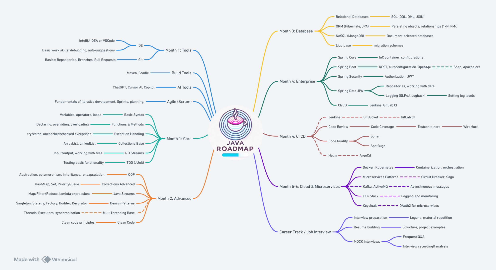

# Path to Middle Java Developer in 4–6 Months
## Version 1.1.1

**Workload:** 15–20 hours per week  
[ROADMAP LINK](https://whimsical.com/java-roadmap-v-1-1-J7eVWqZoJABUvBCqqTc672)  

 ---

## Contents
- [Roadmap: Path to Middle Java Developer in 4–6 Months](#roadmap-path-to-middle-java-developer-in-4-6-months)
  - [Contents](#contents)
  - [Introduction](#introduction)
  - [How to Read the Roadmap](#how-to-read-the-roadmap)
  - [Month 1: Tools](#month-1-tools)
  - [Month 1: Core](#month-1-core)
  - [Month 2: Advanced](#month-2-advanced)
  - [Month 3: Database](#month-3-database)
  - [Month 4: Enterprise](#month-4-enterprise)
  - [Month 4: CI/CD](#month-4-cicd)
  - [Month 5-6: Cloud, Microservices and Job Interview](#month-5-6-cloud-microservices-and-job-interview)
  - [Conclusion](#conclusion)
  - [Contacts:](#contacts)

*(If you have less than four months, some blocks can be studied in parallel.)*
 
---

## Introduction
This roadmap shows the path from a basic Java developer to the **Middle** level, including a relevant stack of the most popular technologies currently used in most modern companies. The roadmap is designed for complete beginners as well as those who already have basic knowledge of Java. It also targets developers who are currently struggling to find a job. The sections starting from Enterprise will help you master the necessary hard skills for the microservices stack. The Career Track section will help you gain the necessary soft skills and hone your interview skills. You can start the Career Track in parallel with studying the Enterprise level. Updates to the roadmap are planned, both for the map itself and for the descriptions of blocks with links.

## How to Read the Roadmap
The diagram shows the blocks you need to study. Each block contains tasks to complete. Dashed lines indicate topics that can be studied theoretically, without practicing them.  
Numbers indicate both the recommended order and the time spent in months, starting from the first block.  
Links to study materials and examples of homework assignments are provided in each block. All materials are free at the time of publication. Most materials are available in English. If you have difficulty with English, you can use a browser with a built-in translator, as well as AI as an assistant to help you understand the material.

**The diagram includes**:

- **Infrastructure Base**: IDE, Git, Build Tools, AI, Agile/Scrum basics
- **Core**: basic syntax, collections, input-output, exceptions, TDD, Checkstyle
- **Advanced**: OOP, advanced collections, Java Streams, serialization, GC, JVM, patterns, SOLID, multithreading
- **Database**: SQL (DDL, DML, JOIN), ORM (JPA, Hibernate), Liquibase, NoSQL
- **Enterprise**: Spring (Boot, WebFlux, GraphQL, Security, Data JPA), AOP, Logging, Camunda BPMN, CI/CD (GitLab CI, Jenkins)
- **Cloud**: Docker, Docker Compose, Kubernetes, microservices (patterns: circuit breaker, saga, 2 Phase Commit), Keycloak, Kafka, ELK, Spring Cloud (Config/Stream/Feign), ActiveMQ
- **Career track / Job Interview**: Resume writing tips, review of common questions

**Recommended books**:
- *Head First Java*, *Head First OOP*, *Head First SQL*, *Head First Servlets & JSP*  
  for starting and consolidating basic knowledge, as well as more practice with Java Core, OOP, databases, web applications.

And **additional materials** on Spring by Evgeny Borisov (podcasts and series "Dissector"/"Builder"), to better understand how Spring works internally and how Spring Core differs from Spring Boot.
 
---

## Month 1: Tools

| **Block**         | **Description and Goals**                                                                                                                                                           | **Links and Downloads**                                                                                                                                                                                  |
 |------------------|----------------------------------------------------------------------------------------------------------------------------------------------------------------------------------------------------------------------|----------------------------------------------------------------------------------------------------------------------------------------------------------------------------------------------------------|
| **IDE**          | Try running HelloWorld in an online simulator. Install and master a basic development environment: IntelliJ IDEA (Community) / VSCode. Learn the basics of debugging, autocomplete.                                         | – [IntelliJ IDEA Community Download](https://www.jetbrains.com/idea/download/)   – [VSCode (Java Ext)](https://code.visualstudio.com/docs/languages/java)   – [Online IDE w3schools](https://www.w3schools.com/java/java_compiler.asp) |
| **Git**          | Version control system, GitHub/GitLab, branches, merges, pull requests. Goal — store code and work in a team.                                                                                                         | – [Git (Official)](https://git-scm.com/)   – [Pro Git Book](https://git-scm.com/book/en/v2)                                                                                                                                               |
| **Build Tools**  | Maven, Gradle (Ant — less common). Set up build/dependencies, run projects.                                                                                                                                           | – [Maven (Official)](https://maven.apache.org/)   – [Gradle (Official)](https://gradle.org/)                                                                                                                                                |
| **AI Tools**     | ChatGPT, Cursor AI, GitHub Copilot — assistants for writing code, refactoring, generating tests.                                                                                                               | – [Cursor AI](https://www.cursor.so/)   – [GitHub Copilot](https://github.com/features/copilot)   – [ChatGPT](https://chat.openai.com/)                                                                                                 |
| **Agile (Scrum)**| Basic concepts: sprints, backlog, teamwork. Understand how iterative development is done in real projects.                                                                                             | – [Scrum Guide](https://scrumguides.org/)                                                                                                                                                                                                    |

**Sample homework assignments**:
1. Initialize a local Git repository, push to GitHub, create a pull request.
2. Create "Hello, World!" using Maven/Gradle, build the project, check the logs.
3. Learn hotkeys and debugging in IntelliJ or VSCode.
4. (For Agile practice) Try breaking the assignment into several "task-stories" and solve them iteratively.

 ---

## Month 1: Core

| **Block**                 | **Description and Goals**                                                                                                 | **Documentation**                                                                                                                                               |
 |---------------------------|---------------------------------------------------------------------------------------------------------------------|----------------------------------------------------------------------------------------------------------------------------------------------------------------|
| **Basic Syntax**          | Variables, operators, data types, simple constructs (if/else, switch). Goal — be able to write basic code in Java. | – [Oracle Java Tutorial (Basics)](https://docs.oracle.com/javase/tutorial/java/nutsandbolts/)   – *Head First Java* (for an easy start with code examples)   |
| **Data Types, Variables** | Primitives (int, boolean, etc.) and references (String, arrays), scope                                        | – [Data Types (Oracle)](https://docs.oracle.com/javase/tutorial/java/nutsandbolts/datatypes.html)                                                              |
| **Conditionals, Loops**   | Control structures: `for`, `while`, `do-while`, `switch`, `if/else`                                            | – [Java Flow Control](https://docs.oracle.com/javase/tutorial/java/nutsandbolts/flow.html)                                                                     |
| **Functions & Methods**   | Declaration, parameters, return values, overloading                                                            | – [Java Methods (W3Schools)](https://www.w3schools.com/java/java_methods.asp)                                                                                  |
| **Exception Handling**    | try/catch/throw, checked/unchecked exceptions                                                                       | – [Java Exceptions (Oracle)](https://docs.oracle.com/javase/tutorial/essential/exceptions/)                                                                    |
| **Collections Base**      | ArrayList, LinkedList (at least). Understanding how to store data sets.                                              | – [Collections (Oracle)](https://docs.oracle.com/javase/tutorial/collections/)                                                                                 |
| **I/O Streams**           | Input-output (FileInputStream, FileOutputStream, BufferedReader). Be able to read/write files.                      | – [Java I/O (Baeldung)](https://www.baeldung.com/java-io)                                                                                                      |
| **TDD (basics)**          | Initial testing practice: JUnit, writing simple tests. Mastering the red-green-refactor pattern. | – [TDD Extreme programming ](https://habr.com/ru/companies/piter/articles/326662/)   –  [JUnit 5 Docs](https://junit.org/junit5/docs/current/user-guide/) |
| **Checkstyle**            | Static code analysis tool, checking for style/errors.                                                     | – [Checkstyle (GitHub)](https://github.com/checkstyle/checkstyle)                                                                                              |

**Sample homework assignments**:
1. **Console games** (choose 1–2): "Guess the number", "Tic-tac-toe", "Hangman".
2. Apply TDD to a couple of methods (e.g., simple calculations).
3. Read/write data from a file (tests to check correct reading).
4. Apply **Checkstyle** to the project, fix style issues.

 ---

## Month 2: Advanced

| **Block**                    | **Description and Goals**                                                                                                                             | **Documentation**                                                                                                                                                                                                           |
 |-----------------------------|-------------------------------------------------------------------------------------------------------------------------------------------------|----------------------------------------------------------------------------------------------------------------------------------------------------------------------------------------------------------------------------|
| **OOP**                     | Classes, objects, encapsulation, inheritance, interfaces, polymorphism. Be able to structure code, create more complex objects.               | – [Java OOP (Oracle)](https://docs.oracle.com/javase/tutorial/java/IandI/)   – *Head First OOP* (additional book with examples and explanations of OOP)                                                                             |
| **Collection Advanced**     | HashMap, Set, Queue, PriorityQueue, etc. Understand operation complexities, internal structures.                                                    | – [Collections (Oracle)](https://docs.oracle.com/javase/tutorial/collections/)                                                                                                                                             |
| **Java Streams**            | Stream API (map/filter/reduce), lambda expressions, functional style.                                                                         | – [Java Streams (Baeldung)](https://www.baeldung.com/java-8-streams-introduction)                                                                                                                                          |
| **Serialization**           | Serializable, JSON (Jackson/Gson). Understand how to save/restore objects.                                                             | – [Serialization (Oracle)](https://docs.oracle.com/javase/8/docs/platform/serialization/)                                                                                                                                  |
| **GC** (Garbage Collection) | GC algorithms (Serial, Parallel, G1, ZGC). Understand how garbage collection works.                                                                        | – [GC Tuning (Oracle)](https://docs.oracle.com/javase/8/docs/technotes/guides/vm/gctuning/)                                                                                                                                |
| **JVM**                     | Bytecode, ClassLoader, JIT compilation, understanding how the JVM works.                                                                              | – [Inside the JVM (Baeldung)](https://www.baeldung.com/jvm)                                                                                                                                                                |
| **Design Patterns**         | Singleton, Factory, Strategy, Observer, Builder. Be able to apply when solving typical problems.                                                     | – [GoF Patterns (Refactoring.Guru)](https://refactoring.guru/design-patterns)                                                                                                                                              |
| **SOLID**                   | Know the principles: Single Responsibility, Open-Closed, Liskov, Interface Segregation, Dependency Inversion. Be able to explain when they apply. | – [SOLID (Baeldung)](https://www.baeldung.com/solid-principles)     – [Bob Martin: Clean Code](https://www.ozon.ru/product/chistyy-kod-sozdanie-analiz-i-refaktoring-biblioteka-programmista-martin-robert-211433291/) |
| **MultiThreading Base**     | Thread, Runnable, ExecutorService, synchronization (synchronized, Lock). Basic skills in writing multithreaded code.  Completable Future.       | – [Java Concurrency (Oracle)](https://docs.oracle.com/javase/tutorial/essential/concurrency/)   - [Guide To CompletableFuture](https://www.baeldung.com/java-completablefuture)    [Java Concurrency in Practice](https://jcip.net/)                            |

**Sample homework assignments**:
1. **Simple multithreading practice** (optional project):
  - Create several threads using a common resource (list/queue) and think through synchronization.
  - Can be limited to short examples, such as running several threads that read/write data from a list.
2. **Streams tasks**: sorting a list of objects, grouping, counting (using filters, mapping).
3. **Implement 2–3 patterns** (Decorator, Singleton, Factory, Strategy) in a mini-project:
"store" with different payment methods (Strategy) + singleton config (Singleton) for storing store constants from the `app.properties` file.
4. **(For SOLID)** Show how the principles can be violated or adhered to in code (example of a mini-application, where we first write "unclean", and then refactor).

> **Note**: Multithreading can complicate the code for beginners, so it's enough to get acquainted with the basic principles (`Thread`, `Runnable`, `synchronized`), without complex projects. If desired, deepen (CompletableFuture, ExecutorService) as an optional part. For interviews, it will be enough to talk about CompletableFuture and the problems of deadlocks, race conditions.

 ---

## Month 3: Database

| **Block**                  | **Description and Goals**                                                                                                                                   | **Documentation**                                                                                                                                                              |
 |---------------------------|-----------------------------------------------------------------------------------------------------------------------------------------------------------------------------------------------|----------------------------------------------------------------------------------------------------------------------------------------------------------------------------------------------------------------------------|
| **Persistence (JDBC / ORM)** | Be able to save data from the application to the database: JDBC for low-level access, ORM (JPA, Hibernate) for object mapping.                                                               | – [Hibernate Docs](https://hibernate.org/orm/documentation/)   – [Spring Data JPA](https://docs.spring.io/spring-data/jpa/docs/current/reference/html/)                                                               |
| **Relational Database**   | SQL (DDL, DML, JOIN & Constraints, Transactions & ACID). PostgreSQL/MySQL.                                                                                                                  | – [SQL (W3Schools)](https://www.w3schools.com/sql/)   – [PostgreSQL Docs](https://www.postgresql.org/docs/)   – *Head First SQL* (for mastering basic SQL in a visual form)                                      |
| **Checkstyle / Code Quality** | Continue to keep the project clean, check the code for style, format, simple errors.                                                                                                    | – [Checkstyle (GitHub)](https://github.com/checkstyle/checkstyle)                                                                                                                                                         |
| **DML / DDL Basics** (also Data Manipulation / Definition)| Creating tables, filling with data, SELECT, UPDATE, DELETE, ALTER, DROP.                                                                                                             | – [Head First SQL](https://docs.google.com/file/d/0BzjGbQIp2abGcW1sYjZvUG9GZmc/edit?pli=1&resourcekey=0-uZYQar6EgXfOUqGL0ZnX9A) (visual explanation)                                                                                                            |
| **JOIN & Constraints**    | INNER, LEFT, RIGHT, FOREIGN KEY, PRIMARY KEY, UNIQUE.                                                                                                                                         | – [SQL JOIN (W3Schools)](https://www.w3schools.com/sql/sql_join.asp)                                                                                                                                                      |
| **Transactions & ACID**   | COMMIT, ROLLBACK, isolation levels.                                                                                                                                                            | – [SQL Transactions (Oracle)](https://docs.oracle.com/cd/B19306_01/server.102/b14220/transact.htm)                                                                                                                        |
| **Migration (Liquibase)** | Tool for versioning schema (Liquibase, Flyway). Convenient for team development.                                                                                                   | – [Liquibase (Official)](https://www.liquibase.org/)   – [Flyway (Official)](https://flywaydb.org/)                                                                                                                    |
| **NoSQL** (MongoDB)       | Document-oriented databases (MongoDB), key-value (Redis), optional.                                                                                                                   | – [MongoDB Docs](https://docs.mongodb.com/)                                                                                                                                                                              |

**Sample homework assignments**:
1. **SQL tasks**: create a couple of tables (User, Order), perform SELECT, UPDATE, DELETE, JOIN.
2. **ORM**: write and read entities (Hibernate). Link 1–M, M–M.
3. **Liquibase**: write a couple of migrations (CREATE TABLE, ALTER TABLE).
4. (Optional) write a **Telegram bot**, which stores user/order data in PostgreSQL (JDBC or JPA).
5. (Optional) **Calculate indicators** for the "online exchange": store buy/sell orders, make an SQL query to calculate the transaction volume.

 ---

## Month 4: Enterprise

| **Block**                              | **Description and Goals**                                                                                                                                                                   | **Documentation**                                                                                                                                                                                    |
 |---------------------------------------|-------------------------------------------------------------------------------------------------------------------------------------------------------------------------------------------------------------------------------|------------------------------------------------------------------------------------------------------------------------------------------------------------------------------------------------------------|
| **Spring Context**     | The mechanism for managing the lifecycle of beans in Spring. Understanding how `ApplicationContext` works, what types of contexts exist (e.g., `AnnotationConfigApplicationContext`). Knowing how to use `@Configuration`, `@Bean`, `@ComponentScan`. | – [Spring Context (Official)](https://docs.spring.io/spring-framework/docs/current/reference/html/core.html#context-introduction)   – [AnnotationConfigApplicationContext](https://docs.spring.io/spring-framework/docs/current/reference/html/core.html#beans-definition-class) |
| **Spring DI (Dependency Injection)** | Understanding the principles of Inversion of Control (IoC), creating and wiring beans, annotations `@Component`, `@Autowired`, `@Configuration`. Separately understand the difference between `@Bean` and `@Component`. | – [Spring Framework (Official)](https://docs.spring.io/spring-framework/docs/current/reference/html/core.html)   – [Spring IoC Container & DI](https://docs.spring.io/spring-framework/docs/current/reference/html/core.html#spring-core) |
| **Spring** (Boot, Web, WebFlux, GraphQL, AOP, Context) | IoC container, auto-configuration, REST controllers, reactive stack (WebFlux), Spring GraphQL (optionally), AOP, bean lifecycle. Understand how Spring Core differs from Spring Boot and how they complement each other.       | – [Spring Framework (Official)](https://docs.spring.io/spring-framework/docs/current/reference/html/)   – [Spring Boot (Official)](https://docs.spring.io/spring-boot/docs/current/reference/html/)   – [Evgeny Borisov: "Spring Dissector", "Spring Builder"](https://www.youtube.com/watch?v=BmBr5diz8WA) (playlists, podcasts)     |
| **Spring Security**                   | Authentication, authorization (Basic, JWT, Keycloak). Roles/permissions, security testing.                                                                                                                                    | – [Spring Security Reference](https://docs.spring.io/spring-security/site/docs/current/reference/html5/)  |
| **Spring Data JPA**                  | Repositories, annotations (e.g., `@Repository`), integration with Hibernate.                                                                                                                                                     | – [Spring Data JPA](https://docs.spring.io/spring-data/jpa/docs/current/reference/html/)                                                                                                                                   |
| **Spring Test**                       | Testing Spring applications (MockMvc, @SpringBootTest).                                                                                                                                                                    | – [Testing in Spring Boot](https://docs.spring.io/spring-boot/docs/current/reference/html/features.html#features.testing)                                                                                                  |
| **Logging** (SLF4J, Logback)          | Logging, log format, levels (INFO, WARN, ERROR).                                                                                                                                                                       | – [SLF4J (Official)](http://www.slf4j.org/)   – [Logback (Official)](http://logback.qos.ch/)                                                                                                                            |
| **Camunda BPMN**                      | Modeling business processes (BPMN 2.0), integration with Spring, starting workflows.                                                                                                                                             | – [Camunda Docs](https://docs.camunda.org/)                                                                                                                                                                                |
| **CI/CD** (GitLab CI, Jenkins)        | Tools for building/testing/deploying. Can be linked to a Spring application, run tests on each push.                                                                                                                        | – [GitLab CI Docs](https://docs.gitlab.com/ee/ci/)   – [Jenkins (Official)](https://www.jenkins.io/)                                                                                                                                         |

In the Spring framework, the key concept is the **IoC container** (Inversion of Control Container). It creates objects (beans) and manages their lifecycle, injecting dependencies (Dependency Injection). The main ways to configure DI:
- Annotations `@Component`, `@Service`, `@Repository`, etc. + `@Autowired` for injecting dependencies.
- Java-based configuration: `@Configuration`, methods with `@Bean`.
- XML configuration (less commonly used in modern projects).

**Sample homework assignments**:
1. learn to separate object (bean) creation from their logic and link them through the container, not manually, reducing code coupling.
2. **CRM system (monolith)**: Spring Boot + Data JPA + Security. CRUD for clients/orders.
3. **Add BPMN** (Camunda) to the CRM project: process model (approve/reject order).
4. **Set up CI** (GitLab CI/Jenkins): build, tests, report results.
5. (Optionally) Connect **GraphQL** (Spring GraphQL) for some queries.

 ---
### Month 4 CI/CD

| **Block**                    | **Description and Goals**                                                                                                                   | **Documentation**                                                                                                                             |
|-----------------------------|---------------------------------------------------------------------------------------------------------------------------------------|-------------------------------------------------------------------------------------------------------------------------------------------------------------------------------------|
| **Jenkins**               | Traditional server for automating builds, running tests, integrations, and deployments. Creating pipelines, configuring jobs through the web interface or Jenkinsfile.                                                                 | – [Jenkins (Official)](https://www.jenkins.io/)   – [Jenkins Getting Started](https://www.jenkins.io/doc/pipeline/tour/getting-started/)                                                                                               |
| **GitLab CI**             | Built-in CI/CD mechanism in GitLab. Describing the pipeline in `.gitlab-ci.yml`. Running tests, building Docker images, publishing artifacts.                                                                                    | – [GitLab CI Docs](https://docs.gitlab.com/ee/ci/)                                                                                                                                                 |
| **Code Review**           | The process of team code review (Merge Request / Pull Request). Analyzing changes, commenting on code, approval from colleagues.                                                                                                 | – [Pull Request (GitHub Docs)](https://docs.github.com/en/pull-requests)   – [GitLab Merge Requests](https://docs.gitlab.com/ee/user/project/merge_requests/)                                                                          |
| **Code Coverage**         | Automatic code coverage checking with tests (e.g., JaCoCo, Cobertura). How many % of lines/branches are covered by tests.                                                                                                     | – [JaCoCo (GitHub)](https://github.com/jacoco/jacoco)                                                                                                                                               |
| **Code Quality**          | Static code quality analysis (SpotBugs, SonarQube, PMD). Finding potential bugs, style inconsistencies, useless code.                                                                                    | – [SonarQube](https://www.sonarqube.org/)   – [SpotBugs (GitHub)](https://github.com/spotbugs/spotbugs)                                                                                          |
| **Helm** (Chart)          | Package manager for Kubernetes. Collecting manifests (`Deployment`, `Service`, `ConfigMap`) into one "Chart" and easy deployment.                                                                                               | – [Helm (Official)](https://helm.sh/docs/)                                                                                                                                                          |
| **WireMock** (optionally)| Local mock of external APIs. Integration testing without real external services.                                                                                                                         | – [WireMock (Official)](https://wiremock.org/)                                                                                                                                                      |
| **SonarQube** (again)     | Centralized Code Quality tool, supports plugins for Jenkins/GitLab.                                                                                                                                         | – [SonarQube (Official)](https://www.sonarqube.org/)                                                                                                                                                |

**Brief description**:
- **CI** (Continuous Integration) means that every code change (commit/pull request) is automatically built and tested in the main branch to immediately identify problems.
- **CD** (Continuous Delivery/Deployment) extends the CI idea, adding automatic deployment to test or even production environments upon successful build and test.

Minimal implementation for a training project:
1. **Pipeline**: steps (build → test → build Docker image).
2. **Test results**: Unit tests (JUnit), Integration tests (if necessary).
3. (Optionally) Automatic deployment to local Kubernetes (minikube) or remote server.

The goal is to be able to write `.gitlab-ci.yml` or GitHub Actions workflow (or config for Jenkins), set up the build, and verify that the tests pass successfully.

## Month 5-6: Cloud, Microservices and Job Interview

| **Block**                   | **Description and Goals**                                                                                                                                                                                                                                                                                                                                                                                                                       | **Documentation**                                                                                                                                                                                                                                |
 |----------------------------|-------------------------------------------------------------------------------------------------------------------------------------------------------------------------------------------------------------------------------------------------------------------------------------------------------------------------------------------------------------------------------------------------------------------------------------------|--------------------------------------------------------------------------------------------------------------------------------------------------------------------------------------------------------------------------------------------------------|
| **Docker, Docker Compose** | Containerization (creating Dockerfile, docker-compose for app + DB). Be able to package and transfer applications, build stands locally.                                                                                                                                                                                                                                                                                           | – [Docker Docs](https://docs.docker.com/)                                                                                                                                                                                                              |
| **Kubernetes**             | Container orchestration: Pods, Deployment, Service, ConfigMap, Secrets. Trial deployment in minikube. Understand the principles of how a cluster works.                                                                                                                                                                                                                                                                                                       | – [Kubernetes Docs](https://kubernetes.io/docs/home/)                                                                                                                                                                                                  |
| **Microservices**          | Splitting a monolith, Spring Cloud (Config, Eureka, Gateway), Micropatterns (circuit breaker, retry, saga, 2 Phase Commit).                                                                                                                                                                                                                                                                                                                | – [Spring Cloud (Official)](https://spring.io/projects/spring-cloud)   – [Microservices.io Patterns](https://microservices.io/patterns/)                                                                                                            |
| **Cloud** (Keycloak, Kafka, ELK, ActiveMQ, Spring Cloud Stream, OpenFeign, Spring Cloud Config) | Tools for authentication (Keycloak), asynchronous communication (Kafka, ActiveMQ), logging/monitoring (ELK), message exchange, service configuration (Config, OpenFeign).                                                                                                                                                                                                                                                        | – [Keycloak Docs](https://www.keycloak.org/documentation)   – [Apache Kafka](https://kafka.apache.org/documentation/)   – [ELK Stack](https://www.elastic.co/guide/index.html)   – [ActiveMQ Docs](https://activemq.apache.org/)              |
| **Code Review / Code Quality** | Code review overview: SonarQube, SpotBugs, Code Coverage. The goal is to maintain a high level of quality.                                                                                                                                                                                                                                                                                                                                             | – [SonarQube](https://www.sonarqube.org/)   – [SpotBugs (GitHub)](https://github.com/spotbugs/spotbugs)                                                                                                                                             |
| **Career Track (CV/Resume, Job Interview)** | Preparing for the interview: reviewing Java Core, Spring, SQL, Docker/K8s, Keycloak, BPMN, microservices. Writing a resume, practicing with example questions, considering different employment options.  Recording each screening, interview (with screen capture, voice recorder). Analyzing questions and reviewing your answers. Comparing them with recordings (mock and real interviews of other people). Repeating until you get an offer. | – [Top Spring Interview Questions](https://www.baeldung.com/spring-interview-questions)   – [Java Interview Q&A (GeeksForGeeks)](https://www.geeksforgeeks.org/java-interview-questions/)    – [Recording screen cast (OBS)](https://obsproject.com/) |

**Sample homework assignments**:
1. **Split the CRM into microservices**: Spring Cloud (Eureka, Feign, Gateway, Config Server). Communication via REST/Kafka.
2. **Containerization**: `docker-compose.yml`, deploy in Kubernetes (minikube).
3. **Keycloak**: set up OAuth2, test logging into the microservice via Keycloak.
4. **ELK**: at a minimum, connect Elasticsearch, see how logs are written in Kibana.
5. **Interview rehearsal**: list of ~50 questions, go through them orally (Java Core, Spring, SQL, Docker, Kubernetes, etc.).
6. (Optionally) **Telegram bot**: link with the microservice, add Keycloak.
7. (Optionally) **Online exchange**: store applications in Kafka, calculate the exchange rate, view logs in Kibana.

 ---

## Conclusion
By going through all these blocks, you master the **basics** (Core) and **advanced topics** (Advanced), learn to work with **SQL** and ORM (JPA/Hibernate), master the **Spring ecosystem** (Boot, Security, Data, AOP, WebFlux, GraphQL), get acquainted with **Camunda BPMN** for business processes, learn **containerization** (Docker, Compose) and **orchestration** (Kubernetes), implement **Keycloak** for authentication, use **Kafka** and **ActiveMQ** for asynchronous communication, and study **microservice patterns**.

In the end, you prepare for the **Job Interview** — write a resume, answer common questions (Java, Spring, microservices, CI/CD). Thus, in **4–6 months** with an workload of 15–20 hours per week, you can achieve a level close to **Middle Java Developer**, having a final project and a set of mini-projects in your portfolio.
 
---

## Contacts
- Personal telegram: *@AlekseiChursin*
